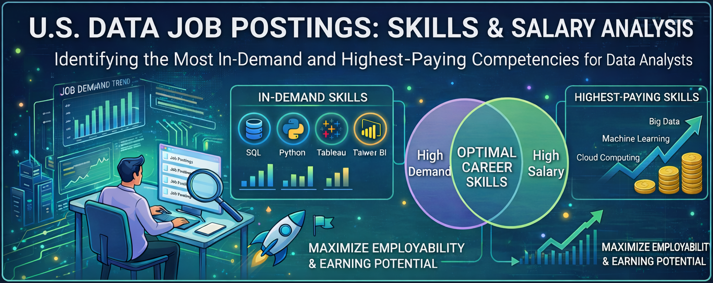
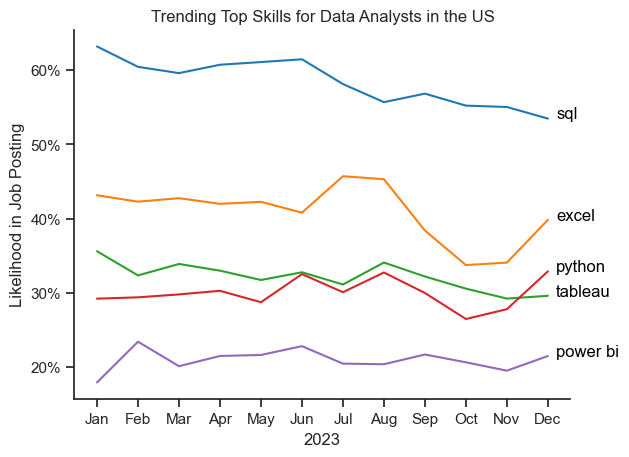
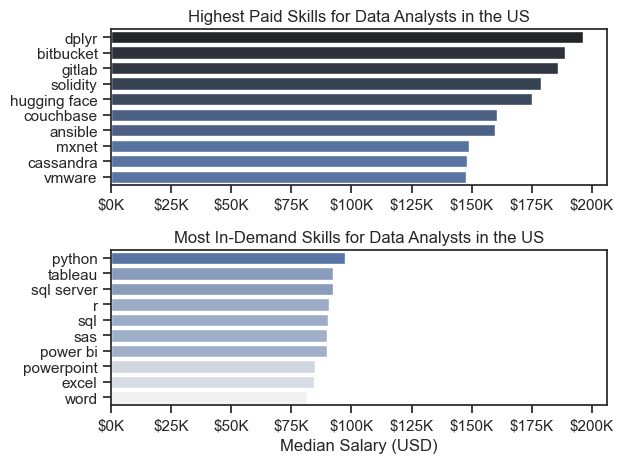
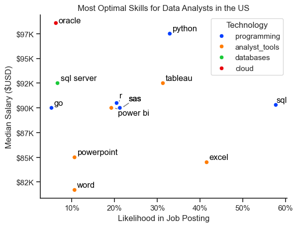

# 📊 Data Analyst Job Market Analysis (US)

## 📌 Executive Summary

This project analyzes U.S. data job postings to identify the most in-demand and highest-paying skills for Data Analysts.

By combining skill frequency with salary data, the analysis reveals which competencies maximize both employability and earning potential.

**Key Insights:**
- SQL remains the foundational skill across all data roles.
- Programming and database expertise significantly increase salary potential.
- Visualization tools (Tableau, Power BI) enhance employability.
- High demand does not always mean high pay — strategic skill stacking is essential.

---

## 🚀 Project Overview

This project evaluates real-world job posting data to determine:

- The most in-demand skills across top data roles  
- Salary trends by role and seniority  
- The highest-paying skills for Data Analysts  
- The most optimal skills (High Demand + High Salary)

---

## 🎯 Business Objective

The goal of this project is to answer a practical career question:

> “Which data skills should I prioritize to maximize job opportunities and salary growth?”

This analysis provides data-driven guidance for:
- Aspiring Data Analysts
- Career switchers
- Data professionals planning skill upgrades
- Hiring managers evaluating skill trends

---

## 📌 Key Business Questions

1. What are the most demanded skills for the top 3 data roles?
2. How are skill demands trending over time for Data Analysts?
3. How well do data roles and individual skills pay?
4. What are the most optimal skills for Data Analysts (High Demand + High Pay)?

---

## 🛠 Tools & Technologies Used

- **Python**
  - Pandas (Data Cleaning & Analysis)
  - Matplotlib & Seaborn (Data Visualization)
  - AST (Data Transformation)
- **Jupyter Notebook**
- **Git & GitHub**
- **VS Code**

---

## 📂 Repository Structure

```
python-data-job-market-analysis-project/
│
├── README.md
├── assets/
│   ├── banner.png
│   ├── salary_distribution.png
│   └── ...
│
├── notebooks/
│   ├── practice-notebooks...
│
├── 1_EDA_Intro.ipynb
├── 2_Skill_Demand.ipynb
├── 3_Skills_Trend.ipynb
├── 4_Salary_Analysis.ipynb
└── 5_Optimal_Skills.ipynb
```

### 📖 Notebook Guide

| Notebook | Purpose |
|----------|---------|
| **1_EDA_Intro** | Initial data exploration and data quality assessment |
| **2_Skill_Demand** | Identifies most in-demand skills across Data Analyst, Scientist, Engineer roles |
| **3_Skills_Trend** | Analyzes how skill demand evolved throughout 2023 |
| **4_Salary_Analysis** | Compares salary distributions and compensation trends |
| **5_Optimal_Skills** | Creates skill matrix combining demand and salary metrics |

---

## 🧹 Data Preparation

**Data Source:** Luke Barousse Data Jobs Dataset  

**Key Steps:**
- Converted job posting dates to datetime format
- Transformed skill strings into structured lists
- Filtered to U.S. postings for stronger salary reliability

### Why U.S. Data?

The U.S. dataset was selected due to higher salary data availability, ensuring more statistically reliable insights.

---

# 📊 Analysis & Insights

---

## 1️⃣ Most In-Demand Skills by Role

Analyzed top 3 most popular roles:
- Data Analyst
- Data Scientist
- Data Engineer

**Findings:**
- SQL dominates Analyst and Scientist roles.
- Python leads Data Engineer and Data Scientist roles.
- Engineers require more specialized cloud/big data tools (AWS, Azure, Spark).
- Excel and Tableau remain essential for Analysts.

📌 Core tools drive employability; specialization differentiates roles.


---

## 2️⃣ Skill Trends for Data Analysts (2023)

Evaluated monthly demand trends.

**Findings:**
- SQL demand remains consistently high.
- Excel shows notable growth toward year-end.
- Python and Tableau remain stable.
- Power BI shows gradual upward movement.

📌 Foundational tools remain stable; visualization skills are gaining traction.



---

## 3️⃣ Salary Distribution Across Data Roles

Compared salary ranges for:
- Data Analyst
- Data Scientist
- Data Engineer
- Senior roles

**Findings:**
- Senior Data Scientists show the highest earning ceiling.
- Engineering roles show greater salary variability.
- Analyst roles are more stable but lower-paying.
- Compensation increases with specialization and seniority.

📌 Technical depth and experience significantly influence salary growth.


---

## 4️⃣ Highest-Paid vs Most In-Demand Skills

Compared:
- Top 10 highest median salary skills  
- Top 10 most frequently requested skills  

**Findings:**
- Specialized tools (Oracle, GitLab, dplyr) command higher pay.
- Foundational tools (SQL, Excel, PowerPoint) dominate job postings.
- High demand ≠ high compensation.

📌 Employability comes from foundational skills; salary growth comes from specialization.



---

## 5️⃣ Most Optimal Skills (High Demand + High Pay)

Combined skill demand % with median salary to identify “high-value” skills.

**High-Value Skills:**
- Python  
- Tableau  
- SQL Server  
- Oracle  
- Advanced database tools  

📌 Programming + Database + Visualization offers the strongest balance of job security and salary potential.




---

# 💡 Strategic Takeaways

- SQL is non-negotiable for Data Analysts.
- Programming skills significantly increase earning ceiling.
- Visualization tools (Tableau / Power BI) enhance employability.
- Database expertise drives salary premiums.
- Career growth requires balancing foundational and specialized skills.

---

# 📈 What This Project Demonstrates

- Structured Exploratory Data Analysis (EDA)
- Real-world data cleaning and transformation
- Salary and demand correlation analysis
- Strategic insight generation
- Clear and effective data visualization
- Business-oriented decision framing

---

# 🔮 Future Improvements

- Compare U.S. vs India job market trends
- Build an interactive Power BI dashboard
- Develop a skill recommendation model
- Apply predictive analysis to skill demand trends

---

# 🏁 Conclusion & Impact

This project converts raw job market data into actionable career intelligence.

By combining demand trends with compensation analysis, it identifies the most strategic skills for Data Analysts to prioritize.

Beyond technical analysis, this work reflects structured problem-solving, business awareness, and data-driven decision-making aligned with real-world workforce planning.

---

## 📬 Connect With Me

If you're hiring for Data Analyst, Business Analyst, or SQL-focused roles, I’d love to connect.
